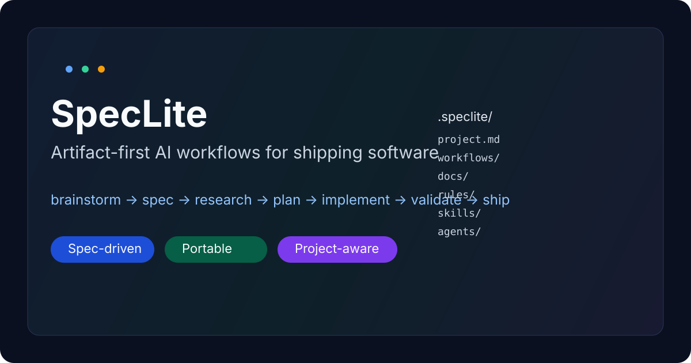

# SpecLite

<p align="center">
  
</p>

<p align="center">
  <a href="#how-it-works"></a>
  <a href="#how-it-works"></a>
  <a href="#works-with-your-tools"></a>
  <a href="#works-with-your-tools"></a>
  <a href="#works-with-your-tools"></a>
  <a href="#works-with-your-tools"></a>
</p>

**SpecLite** is an **artifact-first AI workflow framework for shipping software**.

It gives you the speed of modern agent workflows, but with a cleaner spine:
**brainstorm -> spec -> research -> plan -> implement -> validate -> ship**.

Instead of letting key decisions vanish into chat history, SpecLite writes them into structured artifacts your team can review, diff, reuse, and trust.

## Why people use it

Most AI coding setups are great at momentum and terrible at memory.

They produce:
- lots of prompts
- lots of partial context
- weak handoffs
- fuzzy validation
- tribal knowledge instead of explicit project rules

SpecLite fixes that without turning your workflow into process theater.

You get:
- **front-door workflows** like `brainstorm`, `debug`, `enhance`, `orchestrate`, and `workflow`
- **spec-driven execution** when the work gets real
- **project-local framework files** in `.speclite/`
- **docs and rules** so the codebase can declare how it works
- **portable integrations** for **Codex**, **Cursor**, **Kiro**, and **Claude Code**

## What makes it different

SpecLite is not just a prompt bundle.
It is a **spec-driven framework** with four layers:

1. **Workflows** — how work gets done
2. **Docs** — what the project knows
3. **Rules** — how the codebase should behave
4. **Runs** — what actually happened during execution

That combination is what turns AI-assisted coding into something repeatable.

## The project-local framework

Each repo can carry its own SpecLite layer in `.speclite/`:

```text
.speclite/
  project.md
  workflows/
  docs/
  rules/
  skills/
  agents/
```

This is where a project defines:
- custom workflows
- architecture docs
- feature docs
- engineering rules
- local skills and agent overlays

So SpecLite is no longer guessing how your repo should work — the repo can tell it.

## Quickstart

```bash
./tools/setup.sh
RUN_DIR=$(./tools/new-run.sh "My Project")
./tools/run-phase.sh discovery "$RUN_DIR" --topics "auth,testing"   # optional
./tools/run-phase.sh requirements "$RUN_DIR"
./tools/run-phase.sh research "$RUN_DIR"
./tools/run-phase.sh plan "$RUN_DIR"
./tools/run-phase.sh implementation "$RUN_DIR"
./tools/run-phase.sh validation "$RUN_DIR" --test-cmd "npm test"
./tools/run-phase.sh version-control "$RUN_DIR" --status --commit "Implement feature"
```

To scaffold a project-local framework layer:

```bash
cp -R templates/project/.speclite /path/to/your-repo/.speclite
```

`runs/` is gitignored and created on demand; the repo ships with no run history.

## Core workflows

### Front-door workflows
These are the commands you reach for first:

- **`brainstorm`** — shape ideas before committing to a path
- **`orchestrate`** — classify intent and route to the right workflow
- **`enhance`** — improve an existing feature or codebase
- **`debug`** — isolate, explain, and fix regressions
- **`status`** — summarize what’s done, what’s missing, and what’s next
- **`workflow`** — create, inspect, and extend workflows

### Backbone phases
These are the durable SDLC artifacts underneath:

- **discovery** — external research and best practices
- **requirements** — scope, users, constraints, success criteria
- **research** — local codebase analysis and risk mapping
- **plan** — implementation phases and dependencies
- **implementation** — completed changes and notes
- **validation** — tests, checks, and outcome verification
- **version-control** — git status, diffs, and commit trail

## How it works

SpecLite combines three useful ideas:

1. **intent-driven workflows** for usability
2. **artifact-driven phases** for reliability
3. **project-local docs and rules** for grounding

That means:
- you can start from plain language
- the framework routes you toward the right path
- the actual work lands in inspectable files under `runs/<run_id>/`
- local project rules can shape implementation choices

## Resolution order

When SpecLite looks for workflows, docs, rules, skills, or agents, it should resolve in this order:

1. **project-local** — `.speclite/...`
2. **user-level** — `~/.speclite/...`
3. **built-in** — files shipped with SpecLite

That model makes customization explicit instead of magical.

## Example paths

### New feature in an unfamiliar domain
```text
brainstorm -> discovery -> requirements -> research -> plan -> implementation -> validation -> version-control
```

### Existing feature improvement
```text
enhance -> research -> plan -> implementation -> validation
```

### Bug or regression
```text
debug -> research -> plan -> implementation -> validation
```

### Add a custom project workflow
```text
workflow new release-readiness
```

## Works with your tools

SpecLite is designed to be reusable across projects and editors.

### Cursor commands
- `/brainstorm`
- `/orchestrate`
- `/enhance`
- `/debug`
- `/status`
- `/workflow`
- `/discovery`
- `/requirements`
- `/research`
- `/plan`
- `/implement`
- `/validate`
- `/version-control`

### Claude Code commands
- `/brainstorm`
- `/orchestrate`
- `/enhance`
- `/debug`
- `/status`
- `/workflow`
- `/discovery`
- `/requirements`
- `/research`
- `/plan`
- `/implement`
- `/validate`
- `/version-control`

### Codex skills
- `@framework-brainstorm`
- `@framework-orchestrate`
- `@framework-enhance`
- `@framework-debug`
- `@framework-status`
- `@framework-workflow`
- `@framework-discovery`
- `@framework-requirements`
- `@framework-research`
- `@framework-plan`
- `@framework-implement`
- `@framework-validate`
- `@framework-version-control`

### Kiro agents
- `framework-brainstorm`
- `framework-orchestrate`
- `framework-enhance`
- `framework-debug`
- `framework-status`
- `framework-workflow`
- `framework-discovery`
- `framework-requirements`
- `framework-research`
- `framework-plan`
- `framework-implement`
- `framework-validate`
- `framework-version-control`

## Why this is better than a pile of prompts

A prompt folder can get you started.
SpecLite helps you keep going without losing the thread.

You get:
- a repeatable workflow
- explicit research and planning artifacts
- structured validation
- project-local docs and rules
- reusable integrations
- a clean record of what happened and why

## Why this is lighter than heavyweight spec systems

SpecLite is not trying to make every task feel like enterprise architecture review.

It aims to be:
- **structured enough** to keep quality high
- **light enough** to actually use every day
- **flexible enough** to run only the phases you need
- **grounded enough** to follow project-specific rules when they exist

## Who it is for

SpecLite works especially well for:
- solo builders who want less chaos in AI-assisted work
- engineering teams standardizing AI workflows
- people using Cursor, Codex, Claude Code, or Kiro heavily
- feature work that needs real requirements and validation
- codebases that want explicit docs and local engineering rules

## Artifact contract

Each run stores its work in a predictable structure:

- `discovery/`
  - `discovery.md`
  - `sources.md`
- `requirements/`
  - `requirements.md`
- `research/`
  - `research.md`
  - `index/`
- `plan/`
  - `plan.md`
- `implementation/`
  - `implementation.md`
- `validation/`
  - `validation.md`
  - `test-output.txt`
- `version-control/`
  - `version-control.md`
  - `git-status.txt`
  - `git-diff-stat.txt`
  - `git-diff.txt`
  - `git-commit.txt`

## FAQ

### Do I have to use every phase?
No. Run the full pipeline when it helps, or just the parts you need.

### Is this only for one editor or one model?
No. The structure is editor-agnostic and currently integrates with Codex, Cursor, Claude Code, and Kiro.

### Is this a Spec Kit replacement?
Not exactly. It lives in a similar neighborhood, but it is optimized for lighter day-to-day use, cleaner workflow routing, project-local overrides, and artifact-first execution.

### Can teams use this?
Yes. The run-directory model plus `.speclite/` makes handoffs, review, and repeatability much easier.

## More docs

- `QUICKREF.md` — fast command reference
- `EXAMPLES.md` — example usage patterns
- `integrations/README.md` — editor integration details
- `integrations/claude/README.md` — Claude Code notes
- `workflows/README.md` — workflow catalog
- `CHANGELOG.md` — notable changes
- `MIGRATION.md` — upgrade notes
